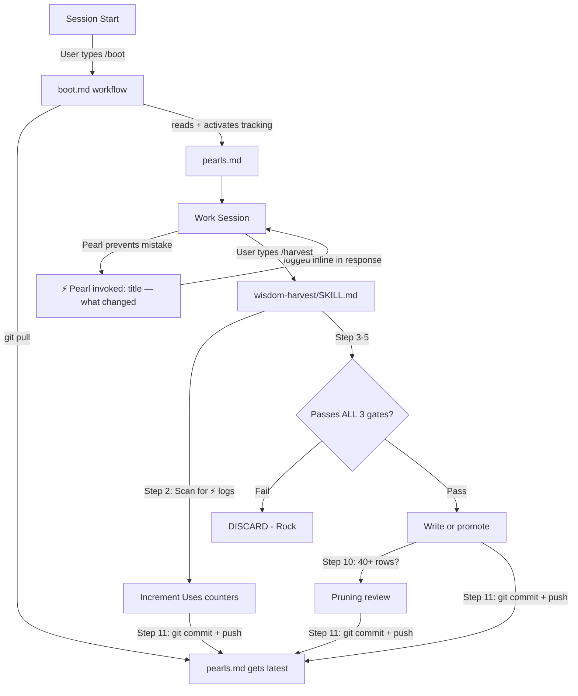

# Collective Wisdom Alignment System — Master Reference

> This document is for any agent or human inheriting this system. It explains what exists, why it was built this way, and how every file fits together.

---

## The Vision

Every agent session generates throwaway intelligence — lessons learned, failure patterns, better approaches. Without a system, that intelligence dies when the session ends. This system captures the generalizable fraction of that intelligence and makes it available to every future agent, in every future session, regardless of project or contributor.

**The goal:** Accumulated organizational wisdom that compounds over time. Each session makes every future session smarter.

---

## How All The Files Work Together



---

## File Map

```
.agent/
├── alignment/
│   ├── SYSTEM.md              ← This document
│   ├── README.md              ← 15-line explainer for new contributors
│   └── pearls.md              ← The knowledge base (table per category)
│
├── skills/
│   ├── wisdom-harvest/
│   │   └── SKILL.md           ← How to extract and quality-gate pearls
│   └── skill-creation-guide/
│       └── SKILL.md           ← How to build skills that work first-try
│
└── workflows/
    └── boot.md                ← Session start: pull + read + internalize
```

### What each file does

| File | Role | Read by |
|------|------|---------|
| `pearls.md` | The knowledge base — 12 pearls, 4 categories, table format | Agent on every `/boot` |
| `boot.md` | Pulls latest, reads pearls, plants harvest reminder | Agent at session start |
| `wisdom-harvest/SKILL.md` | Full 9-step harvest process, 3-gate quality test, maturity model | Agent when user says "harvest" |
| `alignment/README.md` | Human/agent onboarding — the why and how in 15 lines | New contributors |
| `skill-creation-guide/SKILL.md` | 16 principles for building skills that work across models/OS | Agent before building any skill |

---

## The 3-Gate Quality System

This is the core engine. Every pearl candidate must pass ALL THREE gates or it is discarded as a "rock."

| Gate | Question | Fail condition |
|------|----------|----------------|
| **Non-obvious** | Would a competent agent get this wrong by default? | Any reasonable agent already knows this → it's a lookup |
| **Pain-tested** | Did violating this cost real debugging time? | Fix took < 30 seconds → it's trivia |
| **Transferable** | Does this apply to 3+ fundamentally different types of work? | Only helps one domain → belongs in a skill, not pearls |

**The litmus test:** Could you find this on Stack Overflow in 10 seconds? Rock. Did you wish someone had told you this an hour earlier? Pearl.

### Pearls vs Rocks — reference table

| Pearl ✅ | Rock ❌ | Gate failed |
|---------|--------|-------------|
| "Extract data before triggering state changes" | "PowerShell uses semicolons not &&" | Non-obvious |
| "Set a numeric satisfaction threshold to converge" | "git pull doesn't delete untracked files" | Pain-tested |
| "Design shared files as append-only for merge safety" | "Use CDP for PDF instead of pdfkit" | Transferable |

---

## The Pearl Format

Pearls live in `pearls.md` as one table per category:

```markdown
## [Category Name]

| Pearl | Rule | Maturity | Added | Uses |
|-------|------|----------|-------|------|
| [short title] | [one-sentence actionable rule] | Seed/Confirmed/Established | YYYY-MM-DD | 0 |
```

**Hard rules:**
- Rule = one sentence, always actionable ("Use X instead of Y" or "Do X before Y")
- No project names, client names, or filenames
- `Uses` starts at 0 and is incremented by harvest each time a ⚡ invocation log is found

---

## The Maturity Model

Pearls aren't static. They grow in authority as they're independently confirmed.

| Level | Criteria | Agent behavior |
|-------|----------|----------------|
| **Seed** | First observation, passed 3-gate test | Consider it |
| **Confirmed** | Seen independently in 2+ sessions | Follow it |
| **Established** | 3+ sessions OR ratified by human | Treat as law |

When a new harvest finds a similar existing pearl, **promote its maturity** instead of adding a duplicate.

---

## The Harvest Process (9 Steps)

1. **Find boundary** — Is this the first harvest this session? Scan all. Had a previous harvest? Scan only since then.
2. **Extract candidates** — Moments where a general principle was learned
3. **Generalize** — Strip project details, rewrite as universal one-sentence rule
4. **Quality gate** — Run EVERY candidate through the 3-Gate Test. Discard failures.
5. **Dedup check** — Read all of `pearls.md` before writing anything
6. **Write or promote** — New pearl = Seed row. Existing similar pearl = promote maturity
7. **Present summary** — Show user a table: NEW / PROMOTED / DISCARDED, with gate failures named
8. **Pre-commit check** — `git status` first. If nothing changed, another agent already harvested. Warn and stop.
9. **Git sync** — Commit and push

---

## Current Pearl Inventory (22 Pearls, 7 Categories)

| Category | Count | Top Pearl |
|----------|-------|-----------|
| Browser Automation | 3 | "Extract before transform" (Established) |
| Windows Compatibility | 3 | "ASCII-only subprocess output" (Established) |
| Iterative Refinement | 4 | "Recursive self-critique with a target" (Established) |
| General Engineering | 6 | "Never assume response format" (Confirmed) |
| Frontend & Full-Stack | 6 | "Audit display pages after form redesign" (Seed) |
| Database & Auth | 3 | "Check triggers before assuming INSERT fails" (Seed) |

**Pruning threshold: 40 rows.** See Pruning Guide inside `pearls.md` for scoring logic.

---

## Migration Guide: Installing Into a Workspace With an Existing System

### Step 1 — Preserve old pearls (do not lose them)
Read the old alignment file. For each entry, ask: does it pass the 3-Gate Test?
- If yes → add it to `pearls.md` in the correct category at `Seed` maturity
- If no → discard it (it was a rock, not a pearl)

Do this BEFORE overwriting anything.

### Step 2 — Copy the new system files
Copy these folders into the new workspace's `.agent/` directory:
```
.agent/alignment/          ← README.md + SYSTEM.md + pearls.md (with rescued pearls merged in)
.agent/skills/wisdom-harvest/
```

### Step 3 — Merge boot.md (do NOT overwrite)
Do not replace the existing `boot.md`. Instead, open it and:
1. Add at the top (if not present): a `git pull` step
2. Add in the middle: "Read `.agent/alignment/pearls.md` in full, internalize silently"
3. Add at the end: "At session end, offer to run wisdom-harvest if significant iterative work occurred"

### Step 4 — First harvest under the new system
Ask the agent to `/harvest`. This will:
- Apply the 3-gate test to the current session
- Add any genuine pearls
- Discard anything that doesn't survive scrutiny

The new system is now live.

---

## What Makes This System Different From Generic Alignment Docs

| Old-style alignment | This system |
|--------------------|-------------|
| Written once, never updated | Grows every session via harvest |
| No quality gate — anything goes in | 3-gate test rejects rocks before they enter |
| Verbose paragraphs | Dense tables — 12 pearls = 38 lines |
| Agent reads it and forgets | Boot internalizes → plants harvest reminder → loop closes |
| Single contributor | Multi-contributor via git sync |
| Static maturity | Pearls promoted from Seed → Confirmed → Established over time |

---

## Recommended Model Assignment

| Task | Recommended model | Why |
|------|------------------|-----|
| `/boot` (read & internalize) | Any model | Pure instruction-following — all models do this equally |
| `/harvest` (daily) | Sonnet-class minimum | 3-gate judgment requires analytical reasoning |
| Periodic quality audit | Opus-class | Re-grades existing pearls, removes rocks that slipped through Sonnet |
