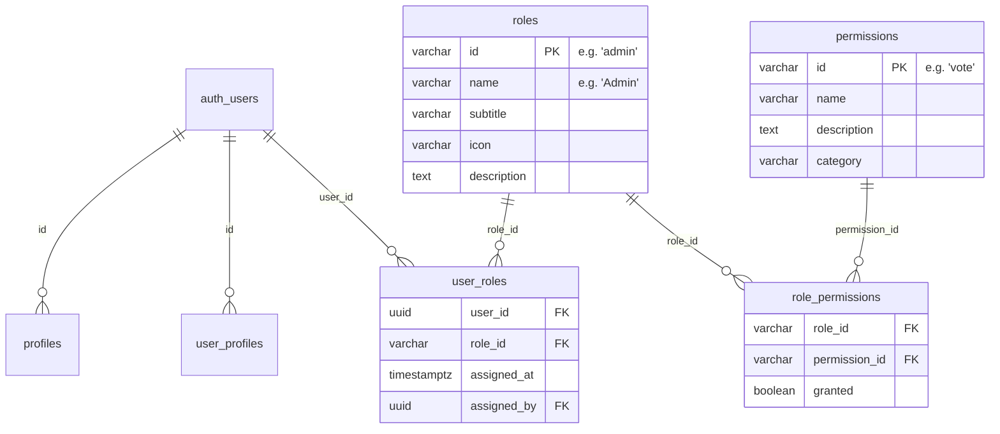

# CPR Voting System Specification

> [!CAUTION]
> **Core Design Principle: Database-Backed Everything**
> All permission checks, role lookups, and filtering MUST be resolved from the database via server-side API queries. No roles, permissions, or authorization state should be cached in localStorage, sessionStorage, cookies, or any other browser-side store.

---

## Part 1: Users & Roles System Reference

### Database Schema



### 11 Roles

| ID | Name | Description |
|---|---|---|
| `plaintiff` | Plaintiff | Case initiator — files cases |
| `defendant` | Defendant | Case responder — provides defense |
| `witness` | Witness | Testimony provider |
| `jury_member` | Jury Member | Votes on case outcomes |
| `attorney` | Attorney | Legal representation |
| `expert_witness` | Expert Witness | Specialized testimony |
| `investigator` | Investigator | Evidence collection |
| `law_enforcement` | Law Enforcement | Official capacity |
| `moderator` | Moderator | Content moderation |
| `admin` | Admin | Full admin access |
| `super_admin` | Super Admin | Full system access |

### 19 Permissions

| Category | Permission | Who Has It |
|---|---|---|
| **Case Mgmt** | `manage_cases` | plaintiff, attorney, admin, super_admin |
| | `respond_to_case` | defendant, attorney, admin, super_admin |
| **Content** | `submit_evidence` | plaintiff, defendant, witness, expert_witness, investigator, law_enforcement, moderator, admin, super_admin |
| | `submit_testimony` | plaintiff, defendant, witness, expert_witness, investigator, law_enforcement, moderator, admin, super_admin |
| | `comment` | all roles |
| | `flag_content` | defendant, investigator, law_enforcement, moderator, admin, super_admin |
| **Moderation** | `verify_evidence` | law_enforcement, moderator, admin, super_admin |
| | `moderate_content` | moderator, admin, super_admin |
| | `delete_posts` | moderator, admin, super_admin |
| | `ban_users` | moderator, admin, super_admin |
| **Voting** | `vote` | jury_member, moderator, admin, super_admin |
| **Admin** | `manage_users` | admin, super_admin |
| | `manage_roles` | admin, super_admin |
| | `manage_permissions` | admin, super_admin |
| | `access_admin_dashboard` | admin, super_admin |
| **Forms** | `access_plaintiff_form` | plaintiff, attorney, admin, super_admin |
| | `access_witness_form` | witness, admin, super_admin |
| | `access_expert_witness_form` | expert_witness, admin, super_admin |
| | `access_investigator_form` | investigator, admin, super_admin |

### Frontend Infrastructure

| File | Purpose |
|---|---|
| `src/app/api/auth/user-permissions/route.ts` | API: resolves user → roles → permissions from DB |
| `src/components/providers/permissions-provider.tsx` | React Context, fetches on mount + auth change |
| `src/hooks/usePermissions.ts` | Hook: `hasPermission()`, `hasRole()`, `isAdmin`, `refetch()` |
| `src/components/auth/PermissionGate.tsx` | Declarative: `<PermissionGate permission="vote">` |
| `src/lib/supabase/middleware.ts` | `/admin` routes require `admin`/`super_admin` role |
| `src/components/layout/app-sidebar.tsx` | Nav items gated by permissions |

### Admin Pages

| Page | Purpose |
|---|---|
| `/admin/users` | User list with search, sort, role filter |
| `/admin/users/roles` | Permission matrix — toggle grants per role |
| `/api/admin/users` | GET users with merged profiles + auth + roles |
| `/api/admin/permissions` | GET/POST role-permission grants |

---

## Part 2: Voting System

### Architecture

```
User (with vote permission)
  └── /cases/[slug] page
        └── VoteCTA component (PermissionGate-wrapped)
              └── /vote?case=<id> page (PermissionGate-wrapped)
                    └── POST /api/votes
                          ├── Auth check
                          ├── Permission check (user_roles → role_permissions)
                          ├── Case status validation
                          ├── Punitive cap enforcement (≤ 2× nominal)
                          └── Upsert into votes table

Admin
  └── /admin/votes page
        └── GET /api/admin/votes (stats, search, filter)
        └── PATCH /api/admin/votes (flag/unflag)
        └── DELETE /api/admin/votes (remove vote)
        └── compute_verdict(case_uuid) SQL function
```

### Vote Flow

1. User browses cases at `/cases`
2. Opens a case detail page (`/cases/[slug]`)
3. If case is in `judgment`, `investigation`, or `pending_convergence` status AND user has `vote` permission → `VoteCTA` card renders
4. User clicks "Vote Now" → navigates to `/vote?case=<id>`
5. Vote page checks `vote` permission via `PermissionGate`
6. User fills form: guilt score (0-10), nominal approval, punitive amount, justification
7. Submit calls `POST /api/votes` which validates everything server-side
8. Existing votes are automatically updated (upsert)

### Implemented Components

| Component | File | Purpose |
|---|---|---|
| Vote Page | `src/app/vote/page.tsx` | Public vote form, gated by `vote` permission |
| VoteCTA | `src/components/cases/vote-cta.tsx` | CTA on case detail, gated by `vote` permission |
| Vote API | `src/app/api/votes/route.ts` | Server-side POST (submit/update) and GET (fetch user's vote) |
| Admin Votes Page | `src/app/admin/votes/page.tsx` | Dashboard with stats, table, flag/delete, detail slideout |
| Admin Votes API | `src/app/api/admin/votes/route.ts` | GET (list), DELETE (remove), PATCH (flag/unflag) |
| Verdict Function | `scripts/compute_verdict.sql` | DB function to aggregate votes → verdict |

### Vote API Validation Rules

| Check | Details |
|---|---|
| Authentication | User must be logged in |
| Permission | User must have `vote` permission (jury_member, moderator, admin, super_admin) |
| Case exists | `case_id` must reference a valid case |
| Case status | Must be `judgment`, `investigation`, or `pending_convergence` |
| Guilt score | Integer 0–10 |
| Punitive cap | Cannot exceed 2× nominal damages claimed |
| Upsert | One vote per user per case — updates replace previous vote |

### Verdict Computation (`compute_verdict`)

| Step | Logic |
|---|---|
| Average guilt | `AVG(guilt_score)` across all votes |
| Verdict | `guilty` if avg ≥ 6, `innocent` if avg < 6 |
| Nominal damages | Majority vote (approved count vs denied count) |
| Punitive damages | Average of all punitive amounts |
| Total restitution | Nominal (if approved) + avg punitive |
| Output | Upserts into `verdict_results` table |

### i18n Keys

All user-facing voting strings are translatable (EN + ES). Admin pages are English-only.

| Key | EN | ES |
|---|---|---|
| `voting.title` | Cast Your Vote | Emite Tu Voto |
| `voting.accessDenied` | You need the Jury Member role... | Necesitas el rol de Miembro del Jurado... |
| `voting.castYourVote` | Cast Your Vote | Emite Tu Voto |
| `voting.ctaDescription` | This case is open for public judgment... | Este caso está abierto para juicio público... |
| `voting.voteNow` | Vote Now | Votar Ahora |
| `voting.updatingExisting` | Updating existing vote | Actualizando voto existente |
| `voting.resultSealed` | You can change your vote until voting closes... | Puedes cambiar tu voto hasta que se cierre... |
| `voting.guilt` | Guilt | Culpa |
| `voting.nominal` | Nominal | Nominal |
| `voting.punitive` | Punitive | Punitivo |
| `voting.total` | Total | Total |

### Database Prerequisites

```sql
-- Ensure votes table has flagged column
ALTER TABLE votes ADD COLUMN IF NOT EXISTS flagged BOOLEAN DEFAULT false;

-- Run compute_verdict function
-- See: scripts/compute_verdict.sql
```
