# CPR Full Spec — Court of Public Record

> **Status**: PARTNER REVIEW REQUIRED — No code until approved
> **Last updated**: Feb 11, 2026

---

## 1. Platform Identity

A **social accountability network** where plaintiffs file individual cases against defendants. Convergence (2+ independent plaintiffs naming the same person) triggers case activation. The public investigates, votes, and delivers verdicts. All records are permanent, searchable, and SEO-indexed.

**Tech stack**: Next.js (App Router, ISR, Server Components) + Supabase (PostgreSQL, Auth, Storage, Realtime, Edge Functions)
**Scale**: Millions of users, mobile-first, 7 languages
**Prototype case**: Colin James Bradley — 10+ plaintiffs, 5 countries

---

## 2. Alignment Answers (50+ decisions)

| # | Question | Answer |
|---|---|---|
| Q1 | Data priority | Queryable fields fast, narrative bulk-loaded |
| Q2 | Scale | Millions of users |
| Q3 | Narrative search | Nice-to-have, not primary filter |
| Q4 | Form save | Auto-save + manual save to `case_drafts` |
| Q5 | Submission flow | Submit → admin review → live |
| Q6 | Editing | Editable with audit trail until verdict, then locked |
| Q7 | Consumers | Public: defendant pages. Auth: plaintiff pages + interactions |
| Q8 | Convergence | 2+ independent plaintiffs required |
| Q9 | Evidence | Supabase Storage (buckets) + SHA-256 hash tamper-proof |
| Q10 | Lifecycle | draft → pending → admin_review → investigation → judgment → verdict → restitution |
| Q12 | Case structure | Separate cases per plaintiff, linked by defendant |
| Q13 | Defendant profile | Admin/AI curates from all plaintiff submissions |
| Q14 | Editability | Audit trail until verdict; super admin only after |
| Q15 | Defendant response | Rich-text posts, subject headings, defendant + super admin |
| V1 | Voting close | Whichever first: deadline OR 400 votes |
| V2 | Voting scale | 1-10, unweighted, hidden until verdict |
| V3 | Verdict line | ≥6 = guilty, ≤5 = innocent |
| V4 | Per-case | Each plaintiff case gets its own independent verdict |
| V5 | Vote changes | Yes, before close |
| V7 | Restitution | Nominal + Punitive (capped 2x) = max 3x |
| V8 | Anti-gaming | Email + phone + CAPTCHA + engagement proof + IP/device fingerprint |
| S1 | Trust Score | Activity + verdict accuracy. 0-100. No peer rating |
| S2 | Posts | Blog-style on profile, commentable |
| S3 | Achievements | Gamification — to co-design |
| S4 | Network | Follow anyone + mutual friends for DMs |
| S5 | Messaging | 1-on-1, attachments, groups. Realtime. Friends-only (admin exempt) |
| S6 | Comments | Threaded + upvote/downvote |
| G1 | Storage | Separate buckets per content type |
| G2 | Moderation | Auto-hide after X flags → admin reviews |
| G3 | Email | Supabase built-in (upgradeable) |
| B1 | Tech | Next.js App Router |
| B2 | RLS | Direct reads + Edge Functions for writes |
| F1 | Home | Hero + trending + featured + how it works + stats |
| F2 | Registration | Email/password or social + forced name & bio |
| F3 | Defendant onboard | Email link → create/use account → join as defendant |
| F4 | Join Case | 3-step wizard for support roles. Plaintiffs always file new cases |
| F5 | Search | Defendant-centric: name, type, status, location, date, financial |
| F6 | Admin | Dashboard + evidence DB + messaging + editing + activity log |
| F7 | Access | Public: defendant pages + browse. Auth: everything else |
| X1 | Attorneys | Appointed by client. One per side. Same access as client. Separate account |
| X2 | Jury | Most important user. Vote + comment + profile. Drive engagement |
| X3 | Realtime | Messages + notifications via Supabase Realtime |
| X4 | Admin DM | From admin panel, bypasses friend requirement |
| Y1 | Ad revenue | Future concern, not in schema |
| Y3 | Attorney flow | Attorney joins → client notification → client approves |
| L1 | View original | Toggle between translated and original text |
| L2 | Manual override | Admin can edit any translation + users can flag bad ones |
| I1 | Translation cost | Microsoft free tier (2M chars/mo) + LibreTranslate self-hosted + IDE review |
| P1 | Evidence hash | SHA-256 per file upload |
| P2 | Safety tiers | Open / Shielded / Protected / Proxy Filing |
| P3 | Dead Man's Switch | Push check-in system for plaintiffs/witnesses |
| P4 | PWA | Mobile-first with offline form save and push notifications |
| P5 | PDF Export | Full case file with QR verification code |
| GA1 | Archived cases | Admin can archive/reactivate. Innocent verdicts auto-archive |
| GA2 | Defendant comment ban | Read-only mode if rules violated (not full ban) |
| GA3 | Multi-role | One account, multiple roles across different cases |
| GA4 | Defendant filing | Defendant can file own case as plaintiff (still needs convergence) |

---

## 3. System Layers & Tables

### Layer A: Core Case System (11 tables)

#### `defendants`
| Column | Type | Notes |
|---|---|---|
| id | uuid PK | |
| first_name, middle_name, last_name, full_name | text | |
| aliases | text[] | GIN indexed |
| photo_url | text | |
| location, date_of_birth, phone, address | text | Convergence keys |
| business_names | text[] | |
| social_profiles | jsonb | |
| status | text | active / merged / archived |
| slug | text UNIQUE | URL slug: colin-james-bradley |
| created_at | timestamptz | |

#### `cases`
| Column | Type | Notes |
|---|---|---|
| id | uuid PK | |
| case_number | text UNIQUE | C-XXXX |
| defendant_id | uuid FK | |
| plaintiff_id | uuid FK | |
| case_types | text[] | GIN indexed |
| status | text | Lifecycle state |
| original_language | text | Language plaintiff wrote in |
| current_step | int | |
| relationship_narrative | jsonb | Step 2 |
| promise_narrative | jsonb | Step 3 |
| betrayal_narrative | jsonb | Step 4 |
| personal_impact | jsonb | Step 6 |
| legal_actions | jsonb | Step 9 |
| story_narrative | jsonb | Steps 10-11 |
| visibility_settings | jsonb | Step 11 + safety tier |
| consent | jsonb | Step 12 |
| nominal_damages_claimed | numeric | |
| is_locked | boolean | |
| is_archived | boolean | Admin can toggle |
| locked_by | uuid FK | |
| voting_deadline | timestamptz | |
| verdict_at | timestamptz | |
| created_at, updated_at | timestamptz | |

#### `case_drafts`
| Column | Type | Notes |
|---|---|---|
| id | uuid PK | |
| user_id | uuid FK | |
| case_id | uuid FK nullable | Joining existing case |
| defendant_id | uuid FK nullable | New case |
| role | text | plaintiff / witness / expert / investigator / law_enforcement |
| current_step | int | |
| form_data | jsonb | Entire form blob |
| updated_at | timestamptz | |
| UNIQUE(user_id, case_id, role) | | |

#### `financial_impacts`
| Column | Type |
|---|---|
| id | uuid PK |
| case_id | uuid FK |
| direct_payments, lost_wages, property_loss, legal_fees, medical_costs, credit_damage, other_amount | numeric |
| other_description | text |
| total_lost | numeric |
| recovery_status | text |
| amount_recovered | numeric |

#### `timeline_events`
| Column | Type |
|---|---|
| id | uuid PK |
| case_id, submitted_by | uuid FK |
| event_type, date_or_year, description | text |
| country, city | text |
| latitude, longitude | float |
| witnesses_present | text[] |
| evidence_refs | jsonb |
| original_language | text |
| sort_order | int |
| is_immutable | boolean |
| created_at | timestamptz |

#### `evidence`
| Column | Type | Notes |
|---|---|---|
| id | uuid PK | |
| case_id, submitted_by | uuid FK | |
| title, description, category | text | |
| file_url, file_type | text | |
| file_hash | text | SHA-256 tamper-proof |
| is_verified | boolean | Admin verifies |
| is_immutable | boolean | |
| created_at | timestamptz | |

#### `witnesses`
| Column | Type |
|---|---|
| id | uuid PK |
| case_id | uuid FK |
| witness_type | text |
| full_name, contact_info | text |
| details | jsonb |
| created_at | timestamptz |

#### `defendant_responses`
| Column | Type |
|---|---|
| id | uuid PK |
| case_id, defendant_user_id | uuid FK |
| subject_heading | text |
| body_html | text |
| original_language | text |
| sort_order | int |
| created_at | timestamptz |

#### `case_versions`
| Column | Type |
|---|---|
| id | uuid PK |
| case_id | uuid FK |
| version_number | int |
| edited_by | uuid FK |
| changed_fields | text[] |
| previous_data | jsonb |
| created_at | timestamptz |

#### `case_roles`
| Column | Type | Notes |
|---|---|---|
| id | uuid PK | |
| case_id, user_id | uuid FK | |
| role | text | witness / attorney / expert_witness / investigator / jury_member / law_enforcement |
| side | text nullable | Attorney: plaintiff / defendant |
| motivation | text | |
| abilities | text[] | |
| status | text | pending / approved / rejected |
| appointed_by | uuid FK nullable | Attorney: client who approved |
| assigned_by | uuid FK nullable | Admin who approved |
| created_at, updated_at | timestamptz | |

#### `case_followers`
| Column | Type |
|---|---|
| id | uuid PK |
| case_id, user_id | uuid FK |
| notify_email, notify_in_app | boolean |
| created_at | timestamptz |

---

### Layer B: Voting & Verdicts (4 tables)

#### `votes`
| Column | Type | Notes |
|---|---|---|
| id | uuid PK | |
| case_id, voter_id | uuid FK | UNIQUE(case_id, voter_id) |
| guilt_score | int | 1-10. ≥6 = guilty, ≤5 = innocent |
| nominal_approved | boolean | |
| punitive_amount | numeric nullable | Capped 2x nominal |
| justification | text | |
| voted_at, updated_at | timestamptz | |

#### `verdict_results`
| Column | Type |
|---|---|
| id | uuid PK |
| case_id | uuid FK UNIQUE |
| total_votes | int |
| average_guilt_score | numeric |
| verdict | text |
| nominal_approved_pct | numeric |
| nominal_amount, median_punitive, total_restitution | numeric |
| computed_at | timestamptz |

#### `restitution_orders`
| Column | Type |
|---|---|
| id | uuid PK |
| case_id, defendant_user_id, plaintiff_user_id | uuid FK |
| nominal_amount, punitive_amount, total_amount | numeric |
| deadline | timestamptz |
| status | text |
| created_at | timestamptz |

#### `payments`
| Column | Type |
|---|---|
| id | uuid PK |
| order_id | uuid FK |
| amount | numeric |
| stripe_charge_id | text |
| status | text |
| paid_at | timestamptz |

---

### Layer C: Social (5 tables)

#### `user_profiles`
| Column | Type | Notes |
|---|---|---|
| id | uuid PK (= auth.users.id) | Merged with old `profiles` |
| display_name | text | Required at registration |
| tagline | text | |
| avatar_url, cover_photo_url | text | |
| bio | text | Required at registration |
| language | text | UI language preference |
| is_verified | boolean | |
| profile_completion | int | 0-100% |
| trust_score | numeric | 0-100 |
| follower_count, following_count, case_count | int | Denormalized |
| is_comment_banned | boolean | Read-only mode |
| last_active_at, joined_at | timestamptz | |

#### `user_follows`
| Column | Type |
|---|---|
| id | uuid PK |
| follower_id, following_id | uuid FK |
| created_at | timestamptz |
| UNIQUE(follower_id, following_id) |

#### `friendships`
| Column | Type |
|---|---|
| id | uuid PK |
| requester_id, addressee_id | uuid FK |
| status | text |
| created_at, updated_at | timestamptz |
| UNIQUE(requester_id, addressee_id) |

#### `posts`
| Column | Type |
|---|---|
| id | uuid PK |
| author_id | uuid FK |
| title, body_html | text |
| original_language | text |
| is_published | boolean |
| created_at, updated_at | timestamptz |

#### `post_comments`
| Column | Type |
|---|---|
| id | uuid PK |
| post_id, author_id | uuid FK |
| parent_id | uuid FK nullable |
| body | text |
| original_language | text |
| upvote_count, downvote_count | int |
| created_at | timestamptz |

---

### Layer D: Case Comments (2 tables)

#### `comments`
| Column | Type |
|---|---|
| id | uuid PK |
| commentable_type | text |
| commentable_id | uuid |
| author_id | uuid FK |
| parent_id | uuid FK nullable |
| body | text |
| original_language | text |
| upvote_count, downvote_count | int |
| is_flagged | boolean |
| flag_count | int |
| is_hidden | boolean |
| created_at | timestamptz |

#### `comment_votes`
| Column | Type |
|---|---|
| id | uuid PK |
| comment_id, user_id | uuid FK |
| vote_type | text |
| created_at | timestamptz |
| UNIQUE(comment_id, user_id) |

---

### Layer E: Messaging (3 tables)

#### `conversations`
| Column | Type |
|---|---|
| id | uuid PK |
| type | text |
| title | text nullable |
| created_at | timestamptz |
| last_message_at | timestamptz |

#### `conversation_participants`
| Column | Type |
|---|---|
| id | uuid PK |
| conversation_id, user_id | uuid FK |
| joined_at | timestamptz |
| last_read_at | timestamptz nullable |

#### `messages`
| Column | Type |
|---|---|
| id | uuid PK |
| conversation_id, sender_id | uuid FK |
| body | text |
| original_language | text |
| attachment_url, attachment_type | text nullable |
| created_at | timestamptz |

> DMs require mutual friendship. Admin bypasses. Supabase Realtime.

---

### Layer F: Notifications (1 table)

#### `notifications`
| Column | Type |
|---|---|
| id | uuid PK |
| user_id | uuid FK |
| type | text |
| case_id | uuid FK nullable |
| title, body | text |
| action_url | text nullable |
| read_at | timestamptz nullable |
| created_at | timestamptz |

> Supabase Realtime for instant push.

---

### Layer G: Caching & Admin (2 tables)

#### `defendant_page_cache`
| Column | Type |
|---|---|
| id | uuid PK |
| defendant_id | uuid FK UNIQUE |
| page_data | jsonb |
| computed_at | timestamptz |

#### `defendant_timeline_visibility`
| Column | Type |
|---|---|
| id | uuid PK |
| defendant_id, timeline_event_id | uuid FK |
| is_visible | boolean |
| toggled_by | uuid FK |
| UNIQUE(defendant_id, timeline_event_id) |

---

### Layer H: Achievements (2 tables)

#### `achievements`
| Column | Type |
|---|---|
| id | uuid PK |
| slug, title, description | text |
| icon_url | text |
| category | text |
| points | int |

#### `user_achievements`
| Column | Type |
|---|---|
| id | uuid PK |
| user_id, achievement_id | uuid FK |
| earned_at | timestamptz |
| UNIQUE(user_id, achievement_id) |

---

### Layer I: Role Submissions (4 tables)

#### `witness_submissions`
| Column | Type |
|---|---|
| id | uuid PK |
| case_id, user_id | uuid FK |
| connection_to_case | text |
| events_witnessed, timeline_observations | jsonb |
| evidence_urls | text[] |
| visibility_preferences | jsonb |
| original_language | text |
| status | text |
| created_at | timestamptz |

#### `expert_submissions`
| Column | Type |
|---|---|
| id | uuid PK |
| case_id, user_id | uuid FK |
| credentials | jsonb |
| field_of_expertise, methodology, professional_statement, conflict_disclosure | text |
| findings, financial_assessment | jsonb |
| supporting_docs | text[] |
| original_language | text |
| status | text |
| created_at | timestamptz |

#### `investigator_submissions`
| Column | Type |
|---|---|
| id | uuid PK |
| case_id, user_id | uuid FK |
| credentials | jsonb |
| methodology, investigation_report | text |
| findings, financial_evidence, connected_cases | jsonb |
| original_language | text |
| status | text |
| created_at | timestamptz |

#### `law_enforcement_submissions`
| Column | Type |
|---|---|
| id | uuid PK |
| case_id, user_id | uuid FK |
| agency_badge, official_records | jsonb |
| actions_taken, statement | text |
| evidence_provided | text[] |
| original_language | text |
| status | text |
| created_at | timestamptz |

---

### Layer J: Internationalization (2 tables)

#### `content_translations`
| Column | Type | Notes |
|---|---|---|
| id | uuid PK | |
| content_type | text | case_narrative / comment / post / defendant_response / timeline_event / witness_submission / expert_submission / investigator_submission |
| content_id | uuid | |
| field_name | text | relationship_narrative / body / description etc. |
| source_language | text | |
| target_language | text | |
| translated_text | text | |
| is_stale | boolean | Source edited, re-translation needed |
| translated_at | timestamptz | |
| UNIQUE(content_type, content_id, field_name, target_language) | | |

#### `translation_queue`
| Column | Type | Notes |
|---|---|---|
| id | uuid PK | |
| content_type | text | |
| content_id | uuid | |
| field_name | text | |
| source_language | text | |
| source_text | text | |
| priority | text | high / normal / low |
| status | text | pending / auto_translated / verified / failed |
| created_at | timestamptz | |

---

### Layer K: Safety System (2 tables)

#### `safety_switches` — Dead Man's Switch
| Column | Type | Notes |
|---|---|---|
| id | uuid PK | |
| user_id | uuid FK | Plaintiff or witness |
| case_id | uuid FK | Which case this is for |
| is_active | boolean | |
| check_in_frequency_hours | int | e.g. 24, 72, 168 |
| max_missed_checkins | int | Trigger threshold, e.g. 3 |
| missed_count | int | Current consecutive misses |
| last_checkin_at | timestamptz | |
| next_checkin_due | timestamptz | Computed |
| triggered_at | timestamptz nullable | When alarm fired |
| created_at | timestamptz | |

#### `emergency_contacts`
| Column | Type | Notes |
|---|---|---|
| id | uuid PK | |
| user_id | uuid FK | |
| full_name | text | |
| relationship | text | Spouse, attorney, parent, etc. |
| phone | text | |
| email | text | |
| created_at | timestamptz | |

---

## 4. Complete Table Count

| Layer | Tables | Count |
|---|---|---|
| A: Core Case | defendants, cases, case_drafts, financial_impacts, timeline_events, evidence, witnesses, defendant_responses, case_versions, case_roles, case_followers | 11 |
| B: Voting | votes, verdict_results, restitution_orders, payments | 4 |
| C: Social | user_profiles, user_follows, friendships, posts, post_comments | 5 |
| D: Comments | comments, comment_votes | 2 |
| E: Messaging | conversations, conversation_participants, messages | 3 |
| F: Notifications | notifications | 1 |
| G: Cache/Admin | defendant_page_cache, defendant_timeline_visibility | 2 |
| H: Achievements | achievements, user_achievements | 2 |
| I: Submissions | witness_, expert_, investigator_, law_enforcement_submissions | 4 |
| J: i18n | content_translations, translation_queue | 2 |
| K: Safety | safety_switches, emergency_contacts | 2 |
| Existing | roles, permissions, role_permissions, user_roles | 4 |
| **Total** | | **42** |

> `profiles` merged into `user_profiles`. 38 new + 4 existing = 42 total.

---

## 5. Case Lifecycle

```mermaid
stateDiagram-v2
    [*] --> draft: Plaintiff starts form
    draft --> pending_convergence: Submit
    pending_convergence --> admin_review: 2nd plaintiff matches
    admin_review --> investigation: Approved
    admin_review --> rejected: Rejected
    investigation --> judgment: Admin opens voting
    judgment --> verdict_guilty: ≥6 avg + 400 votes or deadline
    judgment --> verdict_innocent: ≤5 avg
    verdict_guilty --> restitution: Payment period
    verdict_innocent --> archived: Locked + archived
    restitution --> resolved: Paid
    restitution --> outstanding: Unpaid past deadline
    note right of archived: Admin can reactivate
```



| Status | Editable? | By Whom? |
|---|---|---|
| draft | ✅ Fully | Plaintiff |
| pending_convergence | ✅ Fully | Plaintiff |
| admin_review | ✅ | Plaintiff + Admin |
| investigation | ✅ Audit trail | Plaintiff + Participants |
| judgment | ⚠️ Evidence only | Participants |
| Post-verdict | 🔒 | Super Admin only |

---

## 6. Role-Specific Forms

| Form | Steps | Destination |
|---|---|---|
| Plaintiff | 12 | `cases` + `financial_impacts` + `timeline_events` + `witnesses` |
| Witness | 7 | `witness_submissions` |
| Expert Witness | 9 | `expert_submissions` |
| Investigator | 8 | `investigator_submissions` |
| Law Enforcement | 7 | `law_enforcement_submissions` |
| Defendant Response | Inline | `defendant_responses` |

All drafts save to `case_drafts` (JSONB + role column).

---

## 7. Join Case Flow

3-step wizard for **support roles only** (plaintiffs always file new cases):

1. **Choose Role** — witness / attorney / expert / investigator / jury / law enforcement
2. **Tell Us More** — motivation text
3. **Review & Confirm** — submit

→ `case_roles` entry (pending) → admin approves (or client approves for attorneys).

---

## 8. Attorney Appointment

```
Attorney joins case → selects side (plaintiff/defendant)
    → Client gets notification → Client approves/rejects
    → Attorney gets client-level access on own account
    → One attorney per side. Client can revoke anytime.
```

---

## 9. Plaintiff Flow (New Case)

```
Plaintiff creates account → starts New Case Form
    → Step 1: searches defendant database
    → Defendant EXISTS → selects them
    → Defendant NOT found → creates new defendant entry
    → Completes 12-step form → submits
    → Case status: pending_convergence
    → Second plaintiff names same defendant → admin_review triggers
```

---

## 10. Page Architecture & Routing

### Public
| Route | Content |
|---|---|
| `/` | Hero, trending, featured, stats |
| `/defendants` | Browse/search all defendants |
| `/defendants/[slug]` | THE defendant page (one per person) |
| `/how-it-works` | 6-step explanation |
| `/about` | Platform mission |
| `/legal` | Terms, privacy |
| `/contact` | Contact form |

### Authenticated
| Route | Content |
|---|---|
| `/cases/[case-number]` | Individual plaintiff case page |
| `/profile` | User's own profile (Dashboard, Posts, Achievements, Network) |
| `/profile/[username]` | Public user profile |
| `/messages` | Inbox + conversations |
| `/notifications` | Activity feed |
| `/cases/new` | New Case Form (12 steps) |
| `/cases/[id]/join` | Join Case wizard |
| `/settings` | Account settings |

### Admin
| Route | Content |
|---|---|
| `/admin` | Dashboard stats |
| `/admin/cases` | Case queue + approvals |
| `/admin/convergence` | Defendant identity matching |
| `/admin/evidence` | Searchable evidence database |
| `/admin/timeline` | Master timeline curation |
| `/admin/users` | User management |
| `/admin/moderation` | Flagged content queue |
| `/admin/translations` | Translation review queue |
| `/admin/archive` | Archive/reactivate cases |
| `/admin/activity` | Audit log |

### i18n URL Pattern
```
/defendants/colin-james-bradley        ← English (default)
/th/defendants/colin-james-bradley     ← Thai
/ar/defendants/colin-james-bradley     ← Arabic (RTL)
/vi/defendants/colin-james-bradley     ← Vietnamese
/zh/defendants/colin-james-bradley     ← Chinese
/es/defendants/colin-james-bradley     ← Spanish
/ja/defendants/colin-james-bradley     ← Japanese
```

---

## 11. Internationalization

### 7 Supported Languages
English, Thai, Arabic (RTL), Vietnamese, Chinese (Mandarin), Spanish, Japanese

### Static UI: `next-intl`
- 7 JSON translation files, generated in IDE
- Language switcher in header (globe icon)
- User preference stored in `user_profiles.language`
- Arabic triggers `dir="rtl"` + CSS logical properties

### User Content: Translate on Write → Serve from Cache
```
Content submitted → stored in original language
    → Edge Function queues translation
    → Microsoft Translator free tier (2M chars/mo) auto-translates to 6 others
    → Stored in content_translations
    → If free tier exhausted → LibreTranslate self-hosted ($5/mo, unlimited)
    → Reader gets instant pre-computed translation
    → "View original" toggle available
    → Auto-translations can be flagged → admin VERIFIES via translation_queue
    → Critical testimony reviewed in IDE for quality
```

### Cost: $0-5/month

### UI Translation Maintenance
All public-facing pages use static locale-based translations via JSON files (`src/i18n/locales/{lang}.json`). When any public page is modified or a new feature/display is added:

1. **Add keys to `en.json` first** — every user-visible string (titles, labels, buttons, placeholders, empty states, error messages) must use `t('section.key')` instead of hardcoded text
2. **Add corresponding translations to all supported locale files** — currently: `es.json`, `pt.json`, `fr.json`, `de.json`, `ja.json`, `ar.json`
3. **Client components only** — pages using `useTranslation()` must be client components (`'use client'`)
4. **Keep keys organized by page section** — e.g. `cases.*`, `defendants.*`, `voting.*`

> This applies to all non-admin routes. Admin pages are English-only and do not require translation.

---

## 12. Safety System

### Safety Tiers (Plaintiff/Witness Visibility)
| Tier | Description |
|---|---|
| **Open** | Full identity visible |
| **Shielded** | Display name only, no photo, restricted profile |
| **Protected** | Anonymous code name (Plaintiff A). Admin-only identity |
| **Proxy** | Filed through attorney/advocate. No direct platform interaction |

### Dead Man's Switch
```
Plaintiff/witness activates switch
    → Sets check-in frequency (24h / 72h / 7 days)
    → Sets max missed check-ins (e.g. 3)
    → Enters emergency contacts
    → Receives push notification at each interval
    → Taps "I'm safe" → checked in (one tap, done)
    → Missed check-in → missed_count increments
    → missed_count >= max → TRIGGER:
        → Emergency contacts notified (email + SMS)
        → Platform admin alerted
        → Community notification on case page
        → Alert badge on defendant page
```

---

## 13. Evidence Tamper-Proofing

```
File uploaded → SHA-256 hash computed → stored in evidence.file_hash
    → Timestamp recorded
    → File stored in Supabase Storage
    → Hash is immutable
    → Any challenge → recompute hash → match proves integrity
    → Admin can mark evidence as "verified"
    → PDF export includes hashes for legal use
```

---

## 14. Trust Score

```
Trust Score = Activity (0-60) + Verdict Accuracy (0-40) = 0-100

Activity (0-60):
  +2 per case participated in
  +1 per vote cast
  +1 per evidence submitted
  +3 per case reaching verdict
  +5 defendant paying restitution
  +2 per positively-voted comment
  Cap at 60

Verdict Accuracy (0-40):
  Per completed verdict:
    Within ±2 of final average → +4
    Within ±3 → +2
    Off by >3 → +0
  Normalized to 0-40. Min 10 verdicts to compute.
```

---

## 15. Moderation

```
Flag → flag_count increments
    → flag_count >= threshold → auto-hide + moderation queue
    → Admin: approve (un-hide) OR remove
    → Defendant comment ban: is_comment_banned = true → read-only
    → Activity log tracks all actions
```

---

## 16. File Storage (Supabase)

| Bucket | Max Size | Access |
|---|---|---|
| avatars | 5 MB | Owner write, public read |
| cover-photos | 5 MB | Owner write, public read |
| defendant-photos | 5 MB | Plaintiff write, public read |
| evidence | 50 MB | Participants, public after verified |
| post-images | 10 MB | Author write, public read |
| message-attachments | 25 MB | Participants only (private) |

---

## 17. Realtime

| Feature | Method |
|---|---|
| Messages | Supabase Realtime on `messages` |
| Notifications | Supabase Realtime on `notifications` |
| Dead Man's Switch check-in prompts | Push notifications (PWA) |
| Everything else | Standard fetch + ISR |

---

## 18. Search

Defendant-centric search:
- Name (trigram fuzzy: "Mike" → "Michael")
- Aliases (GIN array)
- Case types (GIN array filter)
- Case status (enum)
- Location (defendant location + timeline events)
- Date range (filed date)
- Financial range (total_lost)

---

## 19. PWA (Progressive Web App)

- Offline form saving via service worker
- Install to home screen
- Push notifications for check-ins, messages, case updates
- Optimized for 3G (lazy-load, compressed assets)
- `next-pwa` package

---

## 20. PDF Case Export

```
📄 CASE FILE — C-2847
Court of Public Record

DEFENDANT: Colin James Bradley
PLAINTIFF: [name or code name per safety tier]
FILED: January 15, 2026
STATUS: Verdict — Guilty (7.8/10)

[Full testimony, timeline, financial impact,
 evidence list with SHA-256 hashes,
 witness list, verdict details,
 restitution order]

[QR code → live case page for verification]
```

---

## 21. Anti-Gaming

- ✅ Email verification
- ✅ Phone verification (1 account per phone)
- ✅ CAPTCHA on vote
- ✅ Engagement proof (scroll/click tracking)
- ✅ IP / device fingerprinting
- ✅ Email alias detection (user+1@gmail)
- ✅ Vote pattern analysis (bulk detection)
- ❌ No account age minimum

---

## 22. RBAC

11 roles × 19 permissions per PERMISSIONS.md. Super Admin edits all forms. Activity log on every admin action.

---

## 23. Indexing Strategy

```sql
-- Defendant search
CREATE INDEX idx_def_name_trgm ON defendants USING gin(full_name gin_trgm_ops);
CREATE INDEX idx_def_aliases ON defendants USING gin(aliases);
CREATE INDEX idx_def_slug ON defendants (slug);

-- Case filtering
CREATE INDEX idx_cases_defendant ON cases (defendant_id);
CREATE INDEX idx_cases_plaintiff ON cases (plaintiff_id);
CREATE INDEX idx_cases_status ON cases (status) WHERE is_archived = false;
CREATE INDEX idx_cases_types ON cases USING gin(case_types);
CREATE INDEX idx_cases_created ON cases (created_at DESC);

-- Financial
CREATE INDEX idx_financial_case ON financial_impacts (case_id);
CREATE INDEX idx_financial_total ON financial_impacts (total_lost DESC);

-- Timeline
CREATE INDEX idx_timeline_case ON timeline_events (case_id, sort_order);
CREATE INDEX idx_timeline_geo ON timeline_events (latitude, longitude) WHERE latitude IS NOT NULL;

-- Votes
CREATE INDEX idx_votes_case ON votes (case_id);
CREATE INDEX idx_votes_voter ON votes (voter_id);

-- Comments
CREATE INDEX idx_comments_target ON comments (commentable_type, commentable_id);
CREATE INDEX idx_comments_parent ON comments (parent_id) WHERE parent_id IS NOT NULL;
CREATE INDEX idx_comments_flagged ON comments (is_flagged) WHERE is_flagged = true;

-- Messages
CREATE INDEX idx_messages_convo ON messages (conversation_id, created_at DESC);
CREATE INDEX idx_convo_parts ON conversation_participants (user_id);

-- Social
CREATE INDEX idx_follows_follower ON user_follows (follower_id);
CREATE INDEX idx_follows_following ON user_follows (following_id);
CREATE INDEX idx_friends_user ON friendships (requester_id, status);

-- Notifications
CREATE INDEX idx_notif_user ON notifications (user_id, read_at) WHERE read_at IS NULL;

-- Translations
CREATE INDEX idx_trans_content ON content_translations (content_type, content_id, target_language);
CREATE INDEX idx_trans_queue ON translation_queue (status, priority);

-- Safety
CREATE INDEX idx_safety_active ON safety_switches (is_active, next_checkin_due) WHERE is_active = true;

-- Submissions
CREATE INDEX idx_witness_sub ON witness_submissions (case_id, status);
CREATE INDEX idx_expert_sub ON expert_submissions (case_id, status);
CREATE INDEX idx_investigator_sub ON investigator_submissions (case_id, status);
CREATE INDEX idx_law_sub ON law_enforcement_submissions (case_id, status);
```

---

## 24. Page → Query Map

| Page | Tables Hit |
|---|---|
| Defendant Page | 1 (defendant_page_cache) |
| Plaintiff Case Page | 5 (cases + financial + timeline + evidence + responses) |
| Witness Slideout | 1 (witness_submissions) |
| User Profile | 3 (user_profiles + posts + user_achievements) |
| Voting Dashboard | 2 (votes + cases) |
| Browse Defendants | 1 (defendants) |
| Comments | 2 (comments + comment_votes) |
| Messages | 2 (conversations + messages) |
| Notifications | 1 |
| Translation on read | 1 (content_translations) |
| Join Case | 1 (case_roles INSERT) |

**Max: 5 tables per page.** Reads are 1-3 tables for 90% of pages.

---

## 25. Remaining Items for Partner

> [!IMPORTANT]
> These items are documented but need partner input during build.

1. **Convergence fuzzy matching** — how aggressive should name matching be?
2. **Case number format** — sequential vs randomized
3. **ISR revalidation** — trigger mechanism for defendant page cache
4. **RLS policies** — detailed per-table specs (implementation phase)
5. **Achievement system design** — specific badges and thresholds
6. **Ad placement strategy** — future revenue model
7. **Legal framework** — terms of service, liability, DMCA
