# Court of Public Record — Platform Blueprint

> **For partner review** · Feb 11, 2026
> Technical reference: [cpr_full_spec.md](file:///C:/Users/WMCIV/.gemini/antigravity/brain/44fcb7ec-b142-40d6-8502-313658038ab2/cpr_full_spec.md)

---

## What We're Building

A **social accountability network** — like a cross between LinkedIn, Reddit, and a courthouse. Plaintiffs file individual cases against defendants. When 2+ independent people name the same person, an investigation opens. The public reviews evidence, votes, and delivers a verdict. Everything is permanent, searchable, and available in 7 languages.

**Prototype case**: Colin James Bradley — 10+ plaintiffs across Australia, Thailand, UAE, Vietnam, and China.

**Built with**: Next.js + Supabase (database, auth, file storage, real-time)

---

## The Big Picture

```mermaid
flowchart LR
    A[Plaintiff] -->|Files case| B[New Case Form]
    B -->|Step 1: Search defendant| C{Defendant exists?}
    C -->|Yes| D[Select existing defendant]
    C -->|No| E[Create new defendant]
    D --> F[Complete 12-step form]
    E --> F
    F -->|Submit| G[Pending Convergence]
    G -->|2nd plaintiff names same person| H[Admin Review]
    H -->|Approved| I[Investigation Opens]
    I -->|Admin opens voting| J[Public Votes 1-10]
    J -->|400 votes or deadline| K{Average score?}
    K -->|≥6| L[Guilty Verdict]
    K -->|≤5| M[Innocent - Archived]
    L --> N[Restitution Ordered]
    N -->|Paid| O[Resolved]
    N -->|Unpaid| P[Outstanding]
```



---

## How Users Experience the Platform

### A Plaintiff's Journey


### A Jury Member's Journey (Most Important User)


### A Defendant's Journey


---

## The 12-Step Plaintiff Form

| Step | What They Fill Out | Why It Matters |
|---|---|---|
| 1 | **Defendant Info** — name, photo, aliases, businesses, location | Identifies the accused + enables convergence matching |
| 2 | **Your Connection** — how you know each other | Establishes relationship context |
| 3 | **The Promise** — what was promised to you | Documents the commit |
| 4 | **The Betrayal** — what actually happened | The core allegation |
| 5 | **Financial Impact** — dollar amounts by category | Quantifies damages (searchable/filterable numbers) |
| 6 | **Personal Impact** — emotional, health, life effects | Human story beyond money |
| 7 | **Timeline** — events with dates and locations | Builds the chronological case (with map pins) |
| 8 | **Others Affected** — witnesses you know of | Names potential corroborators |
| 9 | **Legal Actions** — any police reports, lawsuits | Shows what's been tried |
| 10 | **Tell Your Story** — free-form narrative | Their voice, their words |
| 11 | **Visibility & Safety** — who can see what | Protects vulnerable plaintiffs |
| 12 | **Consent & Submit** — legal agreements | Finalizes the filing |

> Every step auto-saves. Can return anytime. Mobile-friendly.

---

## How Roles Work

### Joining a Case (3-Step Wizard)


### The 7 Roles and What They Can Do

| Role | How They Join | What They Do | Their Form |
|---|---|---|---|
| **Plaintiff** | Files NEW case (never joins existing) | Tells their story, submits evidence | 12 steps |
| **Witness** | Joins via wizard → admin approves | Provides firsthand account | 7 steps |
| **Attorney** | Joins via wizard → client approves | Same access as client, separate account | No form — uses client's |
| **Expert Witness** | Joins via wizard → admin approves | Professional analysis + credentials | 9 steps |
| **Investigator** | Joins via wizard → admin approves | Research findings + reports | 8 steps |
| **Jury Member** | Joins via wizard → open-access | Votes, comments, engages | No form — votes directly |
| **Law Enforcement** | Joins via wizard → admin approves | Official records + statements | 7 steps |

> **Attorneys**: One per side. Appointed by their client. Can be revoked anytime.

---

## The Defendant Page vs. Plaintiff Pages

This is the core architecture:

```mermaid
flowchart TD
    subgraph DP["🏛️ DEFENDANT PAGE (Public)"]
        direction TB
        D1["/defendants/colin-james-bradley"]
        D2["ONE page per defendant — ever"]
        D3["Shows ALL plaintiffs as cards"]
        D4["Master timeline across all cases"]
        D5["Aggregate stats + verdict badges"]
        D6["Comments section"]
    end

    subgraph PP["📄 PLAINTIFF PAGES (Login Required)"]
        direction TB
        P1["Case C-2847: Sarah's story"]
        P2["Case C-2848: David's story"]
        P3["Case C-2849: Somchai's story (Thai)"]
        P4["Each plaintiff has their OWN page"]
        P5["Full testimony, evidence, timeline"]
        P6["Voting happens here (per case)"]
    end

    DP -->|"Click plaintiff card"| PP
```



> **Public visitors** see defendant pages freely. **Logged-in users** access individual plaintiff cases, vote, comment, and interact.

---

## How Voting Works

```mermaid
flowchart TD
    A[Case enters Judgment phase] --> B[Voting opens]
    B --> C[Jury members vote 1-10 on guilt]
    C --> D[Vote yes/no on nominal damages]
    D --> E[Set punitive amount - capped at 2x nominal]
    E --> F[Write justification]
    F --> G{Closing condition?}
    G -->|400 votes reached| H[Voting closes]
    G -->|Deadline reached| H
    H --> I{Average score?}
    I -->|"≥ 6.0"| J["GUILTY"]
    I -->|"≤ 5.0"| K["INNOCENT → Archived"]
    J --> L[Restitution calculated]
    L --> M["Max: 3x nominal (nominal + 2x punitive)"]
```



> **Results are hidden until voting closes.** No one sees the current tally. Voters can change their vote anytime before close.

---

## 7-Language Translation System

### The Challenge
Colin Bradley has plaintiffs who speak Thai, Vietnamese, Arabic, and Chinese. A Thai plaintiff writes testimony in Thai. An English jury member needs to read it in English — instantly.

### How It Works

```mermaid
flowchart TD
    A["Thai plaintiff writes testimony in Thai"] --> B["Stored in original language"]
    B --> C["Background job triggers"]
    C --> D["Auto-translates to 6 other languages"]
    D --> E["Translations cached in database"]
    E --> F["English reader sees English version instantly"]
    F --> G["Toggle: 'View Original' shows Thai text"]
    
    H["Admin flags bad translation"] --> I["Queue for manual review"]
    I --> J["Corrected in IDE together"]
    J --> K["Marked as Verified ✓"]
```



### Supported Languages

| Language | Direction | Notes |
|---|---|---|
| 🇺🇸 English | LTR | Default |
| 🇹🇭 Thai | LTR | Key for Bradley case |
| 🇸🇦 Arabic | **RTL** | Entire UI flips right-to-left |
| 🇻🇳 Vietnamese | LTR | Key for Bradley case |
| 🇨🇳 Chinese (Mandarin) | LTR | Key for Bradley case |
| 🇪🇸 Spanish | LTR | Large global audience |
| 🇯🇵 Japanese | LTR | Future expansion |

### Cost: $0-5/month
- Microsoft Translator free tier: 2 million characters/month
- LibreTranslate self-hosted backup: $5/month unlimited
- Critical testimony: reviewed together in IDE for quality

> Every button, label, form field, and error message is also translated. Arabic users get a fully mirrored RTL interface.

---

## 🛡️ Plaintiff Safety System

### Safety Tiers

| Tier | Who Sees Their Identity | Use Case |
|---|---|---|
| **Open** | Everyone | Plaintiff is comfortable being public |
| **Shielded** | Display name only, no photo | Wants some privacy |
| **Protected** | Code name (Plaintiff A). Only admin knows real identity | Fears retaliation |
| **Proxy** | Filed through attorney. Never touches platform directly | Maximum protection |

### Dead Man's Switch

For plaintiffs and witnesses who feel unsafe. This could save lives.

```mermaid
flowchart TD
    A["Plaintiff activates Dead Man's Switch"] --> B["Sets check-in schedule"]
    B --> C["Every 24h / 72h / 7 days"]
    C --> D["Enters emergency contacts"]
    D --> E["Gets push notification: 'Are you safe?'"]
    E --> F{"Responds?"}
    F -->|"Taps 'I'm Safe' ✓"| G["Check-in recorded. Timer resets."]
    G --> E
    F -->|"No response"| H["Missed check-in counter +1"]
    H --> I{"Missed 3 in a row?"}
    I -->|No| E
    I -->|Yes| J["🚨 ALARM TRIGGERED"]
    J --> K["Emergency contacts notified via email + SMS"]
    J --> L["Platform admin alerted"]
    J --> M["Community notification on case page"]
    J --> N["Alert badge appears on defendant page"]
```



> **How check-in works**: Push notification to phone → one tap "I'm safe" → done. Takes 2 seconds. Miss 3 in a row → everyone is notified.

---

## Evidence Integrity

```mermaid
flowchart LR
    A["File uploaded"] --> B["SHA-256 hash computed"]
    B --> C["Hash + timestamp stored permanently"]
    C --> D["File stored in secure cloud bucket"]
    
    E["Months later: 'Was this edited?'"] --> F["Recompute hash"]
    F --> G{"Matches original?"}
    G -->|Yes| H["✅ Proven unaltered since upload date"]
    G -->|No| I["🚨 File was tampered with"]
```



> Admin can also mark evidence as **Verified ✓**. PDF export includes all hashes for legal use.

---

## Trust Score — How Users Build Reputation

```mermaid
flowchart LR
    subgraph Activity["Activity Points (0-60)"]
        A1["+2 per case joined"]
        A2["+1 per vote cast"]
        A3["+1 per evidence submitted"]
        A4["+3 per case reaching verdict"]
        A5["+2 per positively-voted comment"]
    end
    
    subgraph Accuracy["Verdict Accuracy (0-40)"]
        B1["Your vote vs. final verdict"]
        B2["Within ±2 → +4 points"]
        B3["Within ±3 → +2 points"]
        B4["Off by >3 → +0 points"]
        B5["Requires 10+ verdicts to compute"]
    end
    
    Activity --> C["Trust Score: 0-100"]
    Accuracy --> C
```



> No peer rating. Trust is **earned** through participation and judgment quality.

---

## Admin Dashboard

| Section | What Admin Does There |
|---|---|
| **Dashboard** | Platform-wide stats at a glance |
| **Case Queue** | Review and approve new cases |
| **Convergence** | Verify that two plaintiffs named the same person |
| **Evidence Database** | Search, filter, verify evidence across all cases |
| **Timeline Curation** | Toggle which events appear on master defendant timeline |
| **Moderation Queue** | Review flagged content — approve or remove |
| **Translation Review** | Fix bad auto-translations |
| **User Management** | Manage users, assign roles, ban comments |
| **Archive** | Archive or reactivate cases |
| **Messaging** | DM any user directly (no friend requirement) |
| **Activity Log** | Full audit trail of every admin action |
| **Super Admin** | Edit any case form (with audit trail) |

---

## Anti-Cheating (One Person = One Vote)

| Protection | How It Works |
|---|---|
| **Phone verification** | 1 account per phone number |
| **Email alias detection** | Catches user+1@gmail tricks |
| **CAPTCHA on vote** | Stops bots |
| **Device fingerprinting** | Flags same device, different accounts |
| **IP analysis** | Flags 50 accounts from same IP voting identically |
| **Engagement proof** | Must scroll through evidence before voting |

---

## Mobile-First (PWA)

Most users in Thailand, Vietnam, and China are on **mobile phones with cellular data**.

| Feature | What It Gives Users |
|---|---|
| **Offline form saving** | Start on bus, lose signal, nothing lost |
| **Install to home screen** | Looks like a native app |
| **Push notifications** | Dead Man's Switch check-ins, new messages, case updates |
| **3G optimized** | Lazy-load images, compressed assets |

---

## PDF Case Export

Plaintiffs can export their full case as a professional document for real-world use:

```
📄 CASE FILE — C-2847
Court of Public Record

DEFENDANT: Colin James Bradley
PLAINTIFF: Sarah Mitchell (or "Plaintiff A" if Protected)
FILED: January 15, 2026
STATUS: Guilty — 7.8/10 average (412 votes)

✦ TESTIMONY ✦
[Full narrative in plaintiff's original language + English]

✦ TIMELINE ✦
[Chronological events with dates and locations]

✦ FINANCIAL IMPACT ✦
$47,500 documented losses (7 categories)

✦ EVIDENCE ✦
12 files attached — SHA-256 hashes for verification

✦ VERDICT ✦
Guilty — $47,500 nominal + $35,000 punitive = $82,500

[QR Code → links to live case page for verification]
```

> This bridges the platform to **real-world justice** — hand it to police, lawyers, or insurance companies.

---

## File Storage

| What | Where | Max Size | Who Sees It |
|---|---|---|---|
| Profile photos | `avatars` bucket | 5 MB | Everyone |
| Cover photos | `cover-photos` bucket | 5 MB | Everyone |
| Defendant photos | `defendant-photos` bucket | 5 MB | Everyone |
| Case evidence | `evidence` bucket | 50 MB | Public after verified |
| Blog post images | `post-images` bucket | 10 MB | Everyone |
| Message attachments | `message-attachments` bucket | 25 MB | Conversation members only |

---

## Database Size: 42 Tables

| Layer | What It Covers | Tables |
|---|---|---|
| **Core Cases** | Defendants, cases, drafts, finances, timeline, evidence, witnesses, responses, audit trail, roles, followers | 11 |
| **Voting** | Votes, verdicts, restitution orders, payments | 4 |
| **Social** | Profiles, follows, friendships, blog posts, post comments | 5 |
| **Comments** | Threaded comments with upvote/downvote | 2 |
| **Messaging** | Conversations, participants, messages | 3 |
| **Notifications** | Push + in-app notifications | 1 |
| **Caching** | Pre-computed defendant pages, timeline visibility toggles | 2 |
| **Achievements** | Badge definitions + earned badges | 2 |
| **Role Forms** | Witness, expert, investigator, law enforcement submissions | 4 |
| **Translation** | Cached translations + review queue | 2 |
| **Safety** | Dead Man's Switch + emergency contacts | 2 |
| **Auth (existing)** | Roles, permissions, role-permissions, user-roles | 4 |
| **TOTAL** | | **42** |

---

## Restitution Model

```
Plaintiff claims $5,000 in damages (with evidence)
    ↓
Jury votes YES/NO on the $5,000 (nominal)
    ↓
Jury sets punitive amount → capped at 2x nominal ($10,000 max)
    ↓
Maximum total restitution: $15,000 (3x nominal)
    ↓
Defendant gets payment deadline
    ↓
Paid → Case resolved | Unpaid → Outstanding (public record)
```

---

## What's Left to Decide (Partner Input Needed)

| # | Question | Options |
|---|---|---|
| 1 | **How aggressive should name matching be?** | "Mike Chen" vs "Michael Chen" — fuzzy match or exact? |
| 2 | **Case numbers** | Sequential (C-0001) or random (C-7X3K)? Sequential tells people how many cases exist |
| 3 | **Achievement badges** | What milestones earn badges? First case, 10 votes, etc. — need to design this |
| 4 | **Ad placement** | Future revenue model — where do ads go? |
| 5 | **Legal framework** | Terms of service, liability protection, DMCA process |
| 6 | **Cache refresh triggers** | Technical: how defendant pages rebuild when new cases are added |
| 7 | **Database security** | Detailed row-level security policies (implementation phase) |
